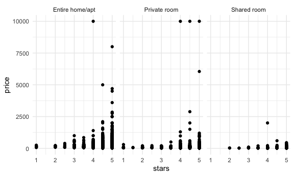

case_study
================
Paula Wu
10/14/2021

``` r
library(p8105.datasets)
data(nyc_airbnb)
```

-   is price correlated with review score?
-   which neighborhood is most popular? most expensive?
-   which neighborhood has the highest reviews?
-   is availability related to price?
-   is room type related to neighborhood?
-   is length of stay related to neighborhood group (borough)?

``` r
nyc_airbnb = 
  nyc_airbnb %>% 
  mutate(stars = review_scores_location/2) %>% 
  rename(borough = neighbourhood_group)
view(nyc_airbnb)
```

Let’s try to count things:

``` r
nyc_airbnb %>% 
  count(borough, room_type) #janitor::tabyl(borough, room_type)
```

    ## # A tibble: 15 × 3
    ##    borough       room_type           n
    ##    <chr>         <chr>           <int>
    ##  1 Bronx         Entire home/apt   192
    ##  2 Bronx         Private room      429
    ##  3 Bronx         Shared room        28
    ##  4 Brooklyn      Entire home/apt  7427
    ##  5 Brooklyn      Private room     9000
    ##  6 Brooklyn      Shared room       383
    ##  7 Manhattan     Entire home/apt 10814
    ##  8 Manhattan     Private room     7812
    ##  9 Manhattan     Shared room       586
    ## 10 Queens        Entire home/apt  1388
    ## 11 Queens        Private room     2241
    ## 12 Queens        Shared room       192
    ## 13 Staten Island Entire home/apt   116
    ## 14 Staten Island Private room      144
    ## 15 Staten Island Shared room         1

``` r
study_data = 
  nyc_airbnb %>% 
  select(-c(id, host_id, host_name, lat, long))
view(study_data)
```

Mine: minimum nights related to review_per_month? or stars?

``` r
study_data = 
  study_data %>% 
  mutate(review_range = round(reviews_per_month, 0))
  #group_by(minimum_nights, reviews_per_month) %>% 
  #summarize(n_obs = n())
```

``` r
study_data %>% 
  count(minimum_nights, review_range)
```

    ## # A tibble: 238 × 3
    ##    minimum_nights review_range     n
    ##             <dbl>        <dbl> <int>
    ##  1              1            0  3636
    ##  2              1            1  2551
    ##  3              1            2  1459
    ##  4              1            3  1101
    ##  5              1            4   752
    ##  6              1            5   421
    ##  7              1            6   231
    ##  8              1            7   125
    ##  9              1            8    56
    ## 10              1            9    27
    ## # … with 228 more rows

``` r
  #pivot_wider()
```

Let’s look at price and room type

``` r
nyc_airbnb %>% 
  ggplot(aes(x = stars, y = price)) +
  geom_point() +
  facet_grid(.~room_type)
```

    ## Warning: Removed 10037 rows containing missing values (geom_point).


Price and neighborhood

``` r
nyc_airbnb %>% 
  filter(borough == "Manhattan") %>% 
  group_by(neighbourhood) %>% 
  summarize(mean_price = mean(price, na.rm = TRUE)) %>% 
  arrange(desc(mean_price))
```

    ## # A tibble: 32 × 2
    ##    neighbourhood     mean_price
    ##    <chr>                  <dbl>
    ##  1 Tribeca                 353.
    ##  2 Flatiron District       319.
    ##  3 NoHo                    302.
    ##  4 Greenwich Village       258.
    ##  5 SoHo                    256.
    ##  6 Midtown                 251.
    ##  7 West Village            239.
    ##  8 Chelsea                 233.
    ##  9 Theater District        232.
    ## 10 Battery Park City       221.
    ## # … with 22 more rows

``` r
nyc_airbnb %>% 
  filter(borough == "Manhattan",
         price <= 1000) %>% 
  mutate(neighbourhood = fct_reorder(neighbourhood, price)) %>% # order by the median 
  ggplot(aes(x = neighbourhood, y = price))+
  geom_boxplot() + 
  coord_flip() + # flip coordinates
  facet_grid(.~room_type)  # not a lot of shared room in expensive neighborhood
```


